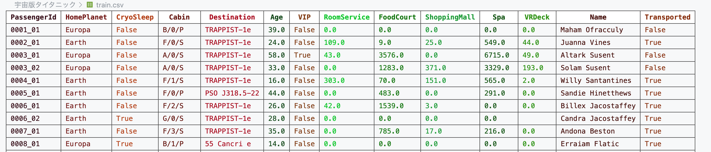

<!---
_class: title
--->
 
 
 

> # 特徴量エンジニアリングとアンサンブルだけで機械学習の精度をあげよう
>

 
 
 

---

<!-- _header: 目標-->

<!-- footer: 2025年6月26日 プログラム言語特論発表 -->
---

<!-- _header: 用語-->
- ### 目的変数 : 機械学習によって求めたい値
- ### 特徴量 : 目的変数を求めるために使える値
- ### 機械学習 : 関数 $f(i_1,...i_n | p_1,...p_m)$ 
  - 学習 : パラメータ、$p_1,...p_m$を変えながらデータを入力する
  - 推論 :  パラメータ、$p_1,...p_m$を変えずに、関数の出力を予測値とする
<!-- footer: 2025年6月26日 プログラム言語特論発表 -->
---

<!-- _header: 結果-->
| ファイル名                               | accuracy     | precision    | recall       | F1-score     |
|----------------------------------------------|-------------:|-------------:|-------------:|-------------:|
| 1_EDAipynb.ipynb                             | –            | –            | –            | –            |
| 2_normal.ipynb                               | 0.7843588269 | 0.8321917808 | 0.7617554859 | 0.7954173486 |
| 3_欠損値.ipynb                              | 0.7826336975 | 0.8424657534 | 0.7546012270 | 0.7961165049 |
| 4_LightGBMによる欠損値.ipynb                | 0.7906843013 | 0.8436073059 | 0.7650103520 | 0.8023887079 |
| 5_特徴量追加.ipynb                          | 0.8010350776 | 0.8310502283 | 0.7861771058 | 0.8079911210 |
| 6_クロスバリデーション.ipynb                | 0.8102357677 | 0.8390410959 | 0.7954545455 | 0.8166666667 |
| 7_結果の解釈:SHAP値.ipynb                   | –            | –            | –            | –            |

<!-- footer: 2025年6月26日 プログラム言語特論発表 -->
---

<!-- _header: 列の説明-->

| 列名            | 説明                                                                                                                                      |
|-----------------|-------------------------------------------------------------------------------------------------------------------------------------------|
| PassengerId     | 各乗客に割り当てられたユニークなID。 `gggg_pp` の形式で、`gggg` はグループ番号、`pp` はグループ内での個人番号を表す。 グループは家族単位であることが多い。  |
| HomePlanet      | 乗客が出発した惑星。通常は、その乗客の永住地である惑星。                                                                                         |
| CryoSleep       | 乗客が航行中に冷凍睡眠を選択したかどうかを示す。 冷凍睡眠中の乗客は、自分の客室に閉じ込められる。                                                            |
| Cabin           | 乗客が滞在している客室番号。「deck/num/side」の形式で、 `side` は左舷 (Port) の場合は P、右舷 (Starboard) の場合は S となる。                               |
| Destination     | 乗客が降りる予定の惑星。                                                                                                                             |
| Age             | 乗客の年齢。                                                                                                                                                      |
| VIP             | 乗客が航行中に特別なVIPサービスの料金を支払ったかどうかを示す。                                                                                                                    |
<!-- footer: 2025年6月26日 プログラム言語特論発表 -->
---

<!-- _header: 列の説明-->

| 列名            | 説明                                                                                                                                      |
|-----------------|-------------------------------------------------------------------------------------------------------------------------------------------|
| RoomService     | 乗客がルームサービスで請求した金額。                                                                                                                                              |
| FoodCourt       | 乗客がフードコートで請求した金額。                                                                                                                                                |
| ShoppingMall    | 乗客がショッピングモールで請求した金額。                                                                                                                                          |
| Spa             | 乗客がスパで請求した金額。                                                                                                                                                        |
| VRDeck          | 乗客がVRデッキで請求した金額。                                                                                                                                                    |
| Name            | 乗客の姓名。                                                                                                                                                                      |
| Transported     | 乗客が異次元空間に転送されたかどうかを示す目的変数。予測の対象となる列。                                                                                                            |

<!-- footer: 2025年6月26日 プログラム言語特論発表 -->
---

<!-- _header: クロスバリデーション-->

- https://www.codexa.net/cross_validation/ 引用

<!-- footer: 2025年6月26日 プログラム言語特論発表 -->

<!-- _header: 今日のソースコードとスライド-->
- https://github.com/FatRicePaddyyyy/data-analysis

<!-- footer: 2025年6月26日 プログラム言語特論発表 -->
